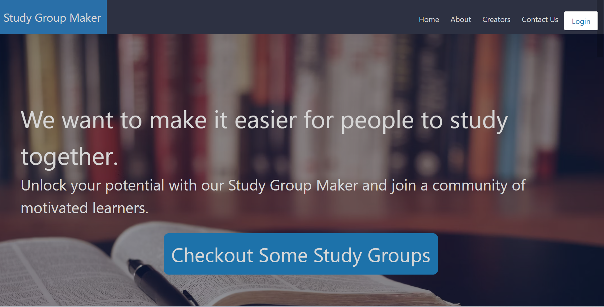
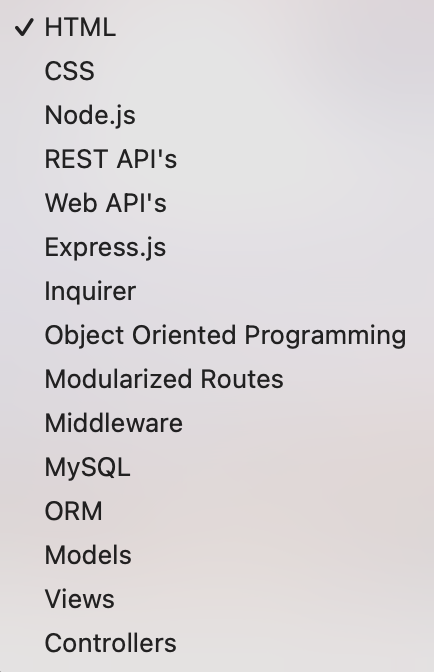
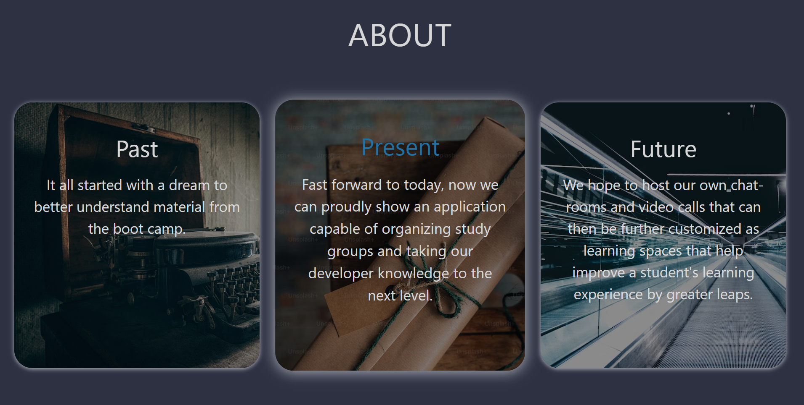

# Study Group Maker 

### Created by: Nam Nguyen, Kendall Smith, Jennifer Dutton, and Shawn Robinson 

---

## **Description**
Feeling stuck on your latest computer science assignment? Wanting to brush up on some content from earlier in the course before the final project? Looking to build up a strong network of peers with similar work ethic and career goals? If so, then the Study Group Maker application was built for you! 

Study Group Maker allows users to:
- Create an account so their information is private and organized just for them
- Create new study groups on a wide range of computer science topics 
- Add new users to groups they are in
- Join existing study groups they can browse on the application 
- Delete existing study groups if they are no longer relevant

The possibilities are endless, as long as the user's ambition to improve their skills is too! 

Users can create or join study groups based around any of the above study topics. 

Users also choose between three skill levels when choosing a group: "Beginner", "Intermediate" and "Advanced". This way, users have the most benefical study session possible, with people who may have similar questions or challenges. 

Study groups also have a description section to become even more specified and focused, beyond just the general topic. 

Study groups are also set at a distinct time, and have a field to provide a meet up link, whether that be a Zoom Invitation, a Google Meet, a Discord call, or whatever else the group is most comfortable with! With the hustle and bustle of everyday life, it was important for us to take the stress of finding WHEN and HOW to meet out of the equation! Now that information is organized and provided for you at the start. Whether you're the earliest bird getting the worm in the morning on Zoom, or the latest-hooting night owl looking to chat on Discord, you will have the freedom to join a group that fits your scheduling needs! 

## **Credits** 
- Sequelize is used for ORM  (https://sequelize.org/)
- Express.js is used for the backend controllers and server (https://expressjs.com/)
- Handlebars is used for page rendering and templates (https://handlebarsjs.com/)
- Bulma is used for styling (https://bulma.io/)
- Swiper.js is used as an additional technology to add a slider (https://swiperjs.com/)

## **License** 
MIT License

Copyright (c) 2023 shawnbradyrobinson

Permission is hereby granted, free of charge, to any person obtaining a copy
of this software and associated documentation files (the "Software"), to deal
in the Software without restriction, including without limitation the rights
to use, copy, modify, merge, publish, distribute, sublicense, and/or sell
copies of the Software, and to permit persons to whom the Software is
furnished to do so, subject to the following conditions:

The above copyright notice and this permission notice shall be included in all
copies or substantial portions of the Software.

THE SOFTWARE IS PROVIDED "AS IS", WITHOUT WARRANTY OF ANY KIND, EXPRESS OR
IMPLIED, INCLUDING BUT NOT LIMITED TO THE WARRANTIES OF MERCHANTABILITY,
FITNESS FOR A PARTICULAR PURPOSE AND NONINFRINGEMENT. IN NO EVENT SHALL THE
AUTHORS OR COPYRIGHT HOLDERS BE LIABLE FOR ANY CLAIM, DAMAGES OR OTHER
LIABILITY, WHETHER IN AN ACTION OF CONTRACT, TORT OR OTHERWISE, ARISING FROM,
OUT OF OR IN CONNECTION WITH THE SOFTWARE OR THE USE OR OTHER DEALINGS IN THE
SOFTWARE.
## **Questions** 
If you have further questions, we can be contacted at any of the following links:
--- 
**Nam (Tommy) Nguyen** 
- (https://github.com/Namhn1231)
- (https://www.linkedin.com/in/nam-nguyen-4922a120b/)
- namhn1231@gmail.com

**Kendall Smith** 
- (https://github.com/kendall529)
- kendall.smith529@gmail.com

**Jennifer Dutton** 
- (https://github.com/jdutton8)
- (https://www.linkedin.com/in/jenny-dutton-963924282/)
- jennydutton7@gmail.com 

**Shawn Robinson** 
- (https://github.com/shawnbradyrobinson)
- (https://www.linkedin.com/in/shawn-robinson-9aaa12170/)
- shawnbradyrobinson1@gmail.com 